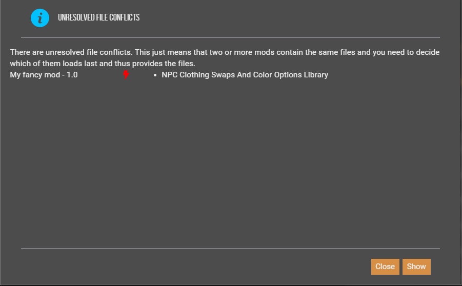
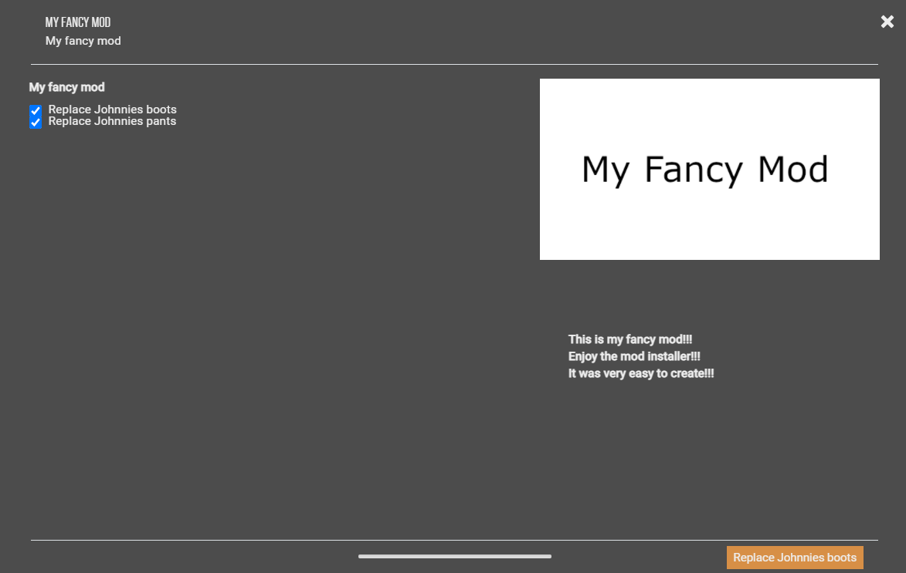
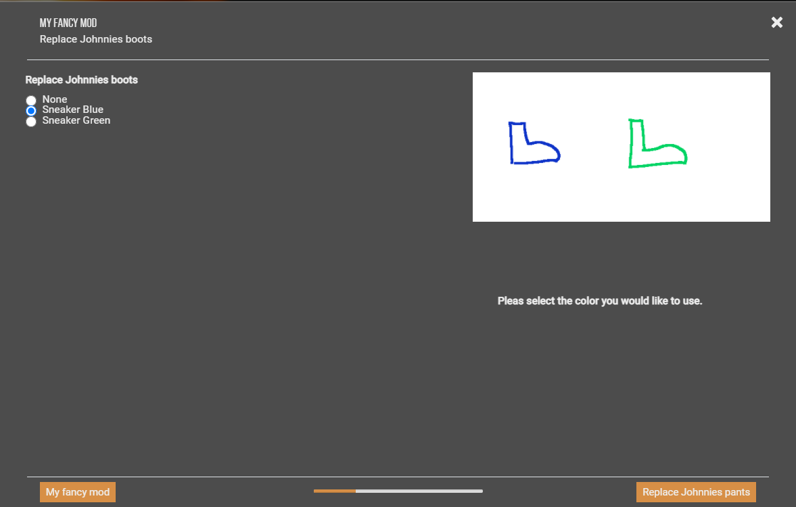
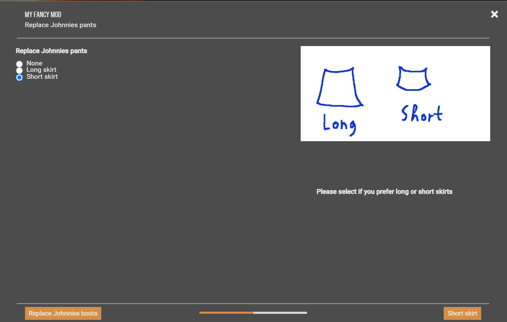
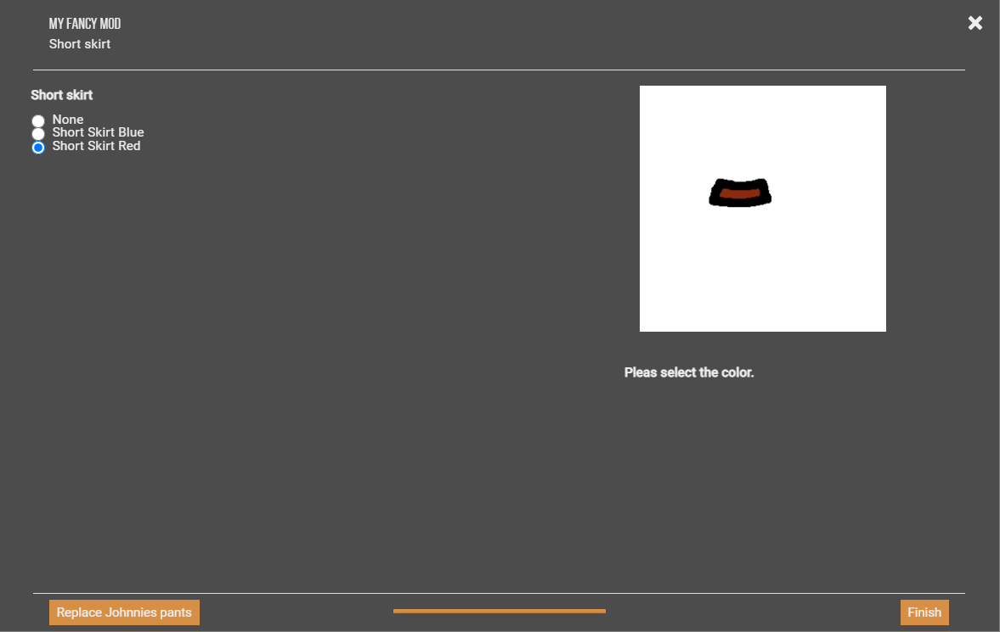

# CyberpunkOutfitInstallerCrater (CpOIC)

CpOIC is an easy-to-use tool to generate mod installers for (mainly) clothing mods for cyberpunk.

Features:

* Easily creates installers for clothing mods
* Therefore, easy installation and uninstallation of clothing mods
* An Easy way to change the installed clothing variant of a mod.
* Handling of clothing mod conflicts (only if both conflicting mods are using CpOIC)

Isn't it a hassle...

You see a nice clothing mod for Cyberpunk at [nexusmods.com](https://www.nexusmods.com), it offers replacements for
Johnnies pants and shoes in different Variants and colors. But which one you should take? The Red short skirt? The blue
pants? Which shoe model and color? Maybe you chose one, copied the .archive files to the Cyberpunk directory but then
you think another one would be better. And again, manual copy and paste...

This tool allows the moder to easily create a mod installer. Then the user can download the mod and Vortex will open the
installer at mod installation. There the user can choose which version he fancy installing. Also, the CpOIC takes care
about the overwritten game item, so the user is warned, when he installs a mod which will replace the same game item.

# About mod installer

The [Vortex](https://www.nexusmods.com/site/mods/1) mod manager allows the moder to create mod installers
([also refered to as FOMOD installer](https://wiki.nexusmods.com/index.php/How_to_create_mod_installers))
which made the mod users live much easier. It essentially adds a menu to the mod installation where one can choose which
variant of a mod should be installed.

At this moment in time the Cyberpunk mod community has no way to simply add a new item to the game. Therefore, they have
to replace an existing item and this introduces a lot of problems.

* Firstly one should not install multiple mods which overwrite the same item at one time.
* Without a mod installer you have to manually copy the mods into your game directory. This is very often the case in
  Cyberpunk and at some point in time you will lose track about which mod is installed at the moment.
* Normally it is tedious to create such an installer, because it is very repetitive. But the CpOIC allows to generate
  such an installer with in only a few minutes

# Minimal example

1. Create the following structure with your mods contend

``` java
My fancy mod/                          //Should have the name of your mod
├── basegame_Short_Skirt_Red.archive
├── basegame_Short_Skirt_Blue.archive
├── common.png                        //An image showing all the variants
├── description.txt                   //some description
└── Items.Q005_Johnny_Pants           //A file named by the code of the item you will replace.
```

2. Make sure you have installed [Java](https://www.java.com/download/help/download_options.html)
2. Download the ![CpOIC][1]
2. Execute it and select the created top folder e.g.: `My fancy mod`
2. Fill out the mod information
2. Then the ![CpOIC][1] will create the zip file for you
2. Upload the zip file
   to [nexusmods](https://www.nexusmods.com) 

### Zipping Disclaimer:

The ![CpOIC][1] provides two zipping variants. Firstly a fully integrated java based zipping. This variant is always
usable, but the archived compression is not that good (sometimes very bad).

Therefore [7-Zip](https://7-zip.org/) will be used if it is locally installed. If 7-Zip is not installed in the standard
directory (`C:\Program Files\7-Zip\7z.exe`)
the install directory has to be set manually (See chapter [Config](#advanced-configuration)).

# How this tool avoids mod conflicts.

**_This mechanism is not good, but it is the best possibility I am aware of. If you have a better idea, please write
me!_**

Requirements:

- The conflicting mods must both use the ![CpOIC][1]

Then the user will be warned at deployment


But simply choosing a solution provided by Vortex does not help.
The user has th be aware that, if he sees this warning
he has to uninstall one of the shown mods.

# A more complex example

[Click here for the full example](./example/A more complex example)

``` java
My fancy mod/                                   // <1> Should have the name of your mod
├── Replace Johnnies pants/                     // <2> One directory per replaced game item 
│   ├── Short skirt/                            // <3> One directory per variant
│   │   ├── basegame_Short_Skirt_Red.archive    // <4> The archive containing the mod files 
│   │   ├── basegame_Short_Skirt_Red.png        // <5> One image per .archive
│   │   ├── basegame_Short_Skirt_Blue.archive
│   │   ├── basegame_Short_Skirt_Blue.png
│   │   ├── description.txt                     // <6> Maybe an description. E.g.: "please select one color for the short skirt"
│   │   └── Items.Q005_Johnny_Pants             // <7> A file with the code of the item a archive will replace.
│   │
│   ├── Long skirt/
│   │   ├── basegame_Long_Skirt_Red.archive
│   │   ├── basegame_Long_Skirt_Blue.archive
│   │   ├── common.png                          // <5> An common image for all archives in one folder
│   │   ├── description.txt                     
│   │   └── Items.Q005_Johnny_Pants
│   ├── common.png                              // <5> An common image for all choices in the folder
│   └── description.txt                         // <6> E.g.: "Would you reather like to replace Johnnies pants by a short or long skirt?"
│
├── Replace Johnnies boots/
│   ├── basegame_Sneaker_Green.archive     
│   ├── basegame_Sneaker_Blue.archive        
│   ├── common.png   
│   ├── Items.Q005_Johnny_Shoes
│   └── description.txt  
│
├── SelectAny                                   // <8> Enables the user to replace multiple items
├── description.txt                             // <6> E.g. "This is my fancy mod! Pleas select whether you like to replace Johnnies pants and / or boots"
├── common.png                                  // <5> The main image of the mod
└── module.jpeg                                 // <9> The main image of the mod. Yes use it here again. 
```

## Detailed description

<details>
  <summary>Click to expand!</summary>

* __<1>__  The so called *workspace* which should have the name of the mod.
* __<2>__  For every game item the mod can replace one should create one Folder in the workspace. If only one item can
  be replaced (e.g. the mod only offers certain variants for Johnnies Pants) this layer can be left out.
* __<3>__  Directories for certain variants. This layer can be skipped if only one variant is offered (
  see: `Replace Johnnies boots/`).
* __<4>__  The archive which contains the modification. They will be copied in to the game folder (
  under `/archive/pc/patch/`).
* __<5>__  For the images there are two possibilities:
    * One can define one image per *.archive*. Then the image should have the same name as the archive, except the
      ending.
    * One can define one common image for all *.archive* files. This should be named `common.<Image ending>`
* __<6>__  In every folder a description can be added. This should be named `description.txt`
* __<7>__  Every directory containing archives should contain a file named exactly the same as the game item which is
  replaced by an archive. The content of the file does not mather.
  __Attention:__ The file should not have an ending like *txt* ore something else. It should have __exactly__
  the same name as the game item.
* __<8>__ By default, the user can only choose one or none option, if the behaviour should be other than that, create a
  file __without__ file ending and name it
  *SelectAtLeastOne*,   *SelectAtMostOne*,   *SelectExactlyOne*,   *SelectAll* or  *SelectAny*. This is useful to allow
  the user, like in the example, to replace Johnnies pants *and*, *or* boots.
* __<9>__ The main image of your mod.

</details>

## And this is the result.

<details>
  <summary>Click to expand</summary>

Firstly you can decide whether you would like to install a replacer for Johnnies boots and/or pants.

Then you can decide on the color of the boots.

Now you can decide which type of skirt you prefere.

And again, the color can be selected.

</details>

# Reporting

**You found a bug? Pleas report it!**

1. Create a report.
    - Normally the ![CpOIC][1] should ask you if a report should be created, if an error occurred.
    - If this is not the case, execute the ![CpOIC][1] with the command line argument `-r`. In
      detail: `java -jar "C:\path\to\CpOIC.jar" -r`. Then run the the ![CpOIC][1] exactly like the last time.

2. Then send the report together with a description, and your contact details, to me. (TODO, add contact details)
3. I will try my best to solve the bug or help you with your problem.

# !!! Help me with your ideas !!!

__Please help me to develop the ![CpOIC][1] further!__

Send in your ideas and requirements. I will do my best to integrate them.

# Do you want to contribute

- Do you have some experiences with java?
- Do you want to develop this software further?
- Send me a brief application.

# Advanced Configuration

View the documented example config:
[config.properties](./example/config.properties)

Command line arguments:

|    long name    | short | description|
|-----------------|-------|------------|
| generateReport  | -r    | Generate a report at the end of execution. For details see the chapter on [Reporting](#reporting)
| workspace       | -w    | Simply sets the workspace directory.

For further possible configuration view the source code: [Config.java](./src/main/java/de/vsc/coi/config/Config.java)


[1]:logo-yellow%2062x14.ico
